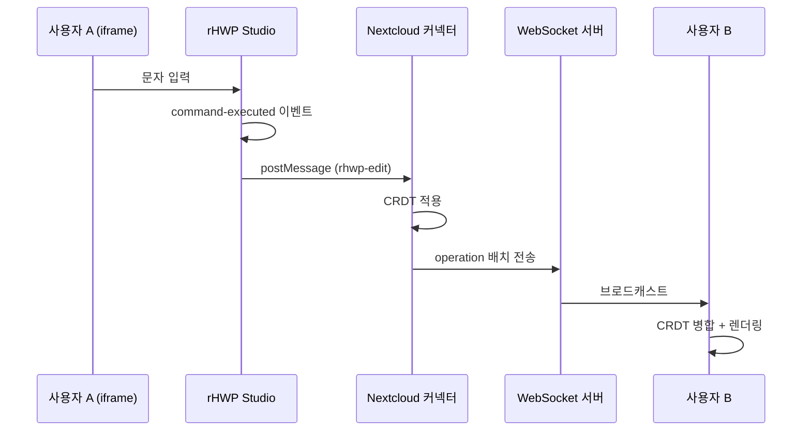

# rHWP 협업 편집

## 개요

| 항목 | 상세 |
|------|------|
| **WebSocket** | `wss://ai.jb.go.kr/rhwp-collab/ws` |
| **내부 포트** | `192.168.0.8:8765` (rhwp-collab 컨테이너) |
| **버전** | v3.0.2 (CRDT 기반) |
| **위치** | `/home/gil/prod-compose/rhwp-collab/` |
| **rHWP Studio** | `https://ai.jb.go.kr/rhwp/` (정적 파일) |
| **Nextcloud 앱** | `rhwp_connector` v3.0.2 |

rHWP는 웹 기반 오픈소스 HWP 뷰어/에디터입니다. Nextcloud와 통합하여 실시간 협업 편집을 지원합니다.

## 아키텍처



## 핵심 컴포넌트

### 1. rHWP Studio (iframe-collab-bridge.ts)

| 역할 | 설명 |
|------|------|
| 이벤트 수신 | `command-executed` 이벤트 구독 |
| 직렬화 | EditCommand → JSON 변환 |
| 전송 | postMessage로 부모 창에 전달 |
| 역직렬화 | 원격 편집 수신 → 명령 실행 |

**지원 명령**:

- `InsertTextCommand` → `insertText`
- `DeleteTextCommand` → `deleteText`
- `InsertLineBreakCommand` → `insertLineBreak`
- `InsertTabCommand` → `insertTab`
- `SplitParagraphCommand` → `splitParagraph`
- `MergeParagraphCommand` → `mergeParagraph`

### 2. Nextcloud 커넥터 (rhwp_connector)

| 파일 | 역할 |
|------|------|
| `js/crdt.js` | 문단별 CRDT 구현 (Lamport Clock) |
| `js/editor.js` | WebSocket 연결 + postMessage 브릿지 |
| `js/files.js` | Files 앱 파일 액션 등록 |
| `css/editor.css` | 원격 커서 스타일 |

**설치 경로**: `/var/www/html/custom_apps/rhwp_connector/` (nextcloud 컨테이너 내부)

### 3. 협업 서버 (Python WebSocket)

| 항목 | 값 |
|------|------|
| 컨테이너 | `rhwp-collab` |
| 내부 포트 | 8765 |
| nginx 프록시 | `/rhwp-collab/` → `http://192.168.0.8:8765/` |
| 히스토리 | 최대 2000 operation |
| REST | `/health` (헬스체크), `/sync` (재연결 복구용) |

## CRDT 동작 원리

### 문자 ID 구조

```javascript
{
  siteId: "site-abc123",    // 클라이언트 고유 ID
  clock: 42,                // Lamport 타임스탬프
  char: "가"                // 문자
}
```

### 충돌 해결

1. 동일 위치 삽입 시 `clock` 비교
2. 같은 clock이면 `siteId` 사전순 비교
3. 항상 결정론적 순서 보장

## 원격 커서 표시

OnlyOffice 스타일 커서 표시:

- 사용자 이름 라벨 (상단)
- 수직 캐럿 선 (편집 위치)
- 7가지 컬러 (사이트 해시 기반)
- 입력 중 깜빡임 애니메이션

```css
.remote-cursor {
  position: absolute;
  pointer-events: none;
  z-index: 100;
}
.cursor-label {
  font-size: 11px;
  padding: 2px 6px;
  border-radius: 3px;
}
```

## 배포

### Nextcloud 앱 업데이트

```bash
# JS/CSS 파일 배포
docker cp /tmp/rhwp_connector/js/files.js nextcloud:/var/www/html/custom_apps/rhwp_connector/js/
docker cp /tmp/rhwp_connector/js/editor.js nextcloud:/var/www/html/custom_apps/rhwp_connector/js/
docker cp /tmp/rhwp_connector/js/crdt.js nextcloud:/var/www/html/custom_apps/rhwp_connector/js/
docker cp /tmp/rhwp_connector/css/editor.css nextcloud:/var/www/html/custom_apps/rhwp_connector/css/

# PHP 컨트롤러 배포
docker cp /tmp/rhwp_connector/lib/Controller/EditorController.php \
    nextcloud:/var/www/html/custom_apps/rhwp_connector/lib/Controller/

# 템플릿 배포
docker cp /tmp/rhwp_connector/templates/editor.php \
    nextcloud:/var/www/html/custom_apps/rhwp_connector/templates/

# 권한 설정
docker exec nextcloud chown -R www-data:www-data /var/www/html/custom_apps/rhwp_connector/

# OPCache 초기화 (필요시)
docker exec nextcloud php -r "opcache_reset();"
```

### 협업 서버 재시작

```bash
cd /home/gil/prod-compose/rhwp-collab
docker compose up -d --force-recreate
```

### rHWP Studio 배포 (정적 파일)

```bash
# 빌드 후 nginx 정적 디렉토리에 배포
cp -r /home/yoon/alpha-test/rhwp/rhwp-studio/dist/* /home/yoon/nginx_static/rhwp/
```

## 트러블슈팅

### HWP 클릭 시 다운로드만 됨

1. Nextcloud 30+ Vue Files 앱은 새 API 사용
2. `files.js`가 DOM 클릭 인터셉터로 작동해야 함
3. Ctrl+F5로 캐시 삭제 후 재시도

### 404 Not Found

Nextcloud가 `/nextcloud/` 경로에 설치된 경우:
```javascript
// files.js에서 OC.webroot 사용
const webroot = OC.webroot || '/nextcloud';
const url = webroot + '/apps/rhwp_connector/' + fileId;
```

### 협업 서버 연결 안 됨

```bash
# 헬스 체크
curl -sf http://192.168.0.8:8765/health

# 컨테이너 상태 확인
docker ps | grep rhwp-collab

# 포트 바인딩 확인 (0.0.0.0:8765 이어야 함, 127.0.0.1 아님)
docker port rhwp-collab
```

### WASM 로딩 에러

`__wbindgen_malloc` 에러 발생 시:
- rHWP Studio의 `wasmReady` 플래그 확인
- postMessage 핸들러에서 WASM 초기화 대기 로직 필요

## 알려진 이슈

!!! warning "iframe 제한"
    rHWP Studio가 iframe 내에서 실행될 때만 협업 기능 활성화.
    독립 실행 시 `window.parent === window`로 감지하여 비활성화.

!!! info "Operation 버퍼링"
    50ms 간격으로 배치 전송하여 네트워크 효율 최적화.
    빠른 타이핑 시에도 메시지 폭주 방지.

!!! warning "Nextcloud 경로"
    Nextcloud가 서브디렉토리(`/nextcloud/`)에 설치된 경우 
    `OC.webroot`를 사용하여 URL 생성 필요.

## 관련 문서

- [HWP Bridge](hwp-bridge.md) - HWP 파일 변환 서비스
- [Nextcloud + OnlyOffice](nextcloud-onlyoffice.md) - 오피스 문서 협업
